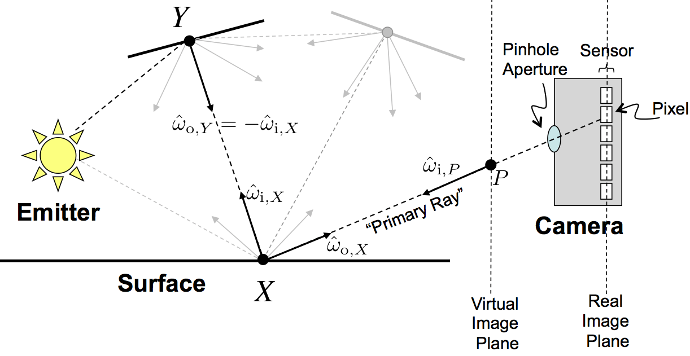
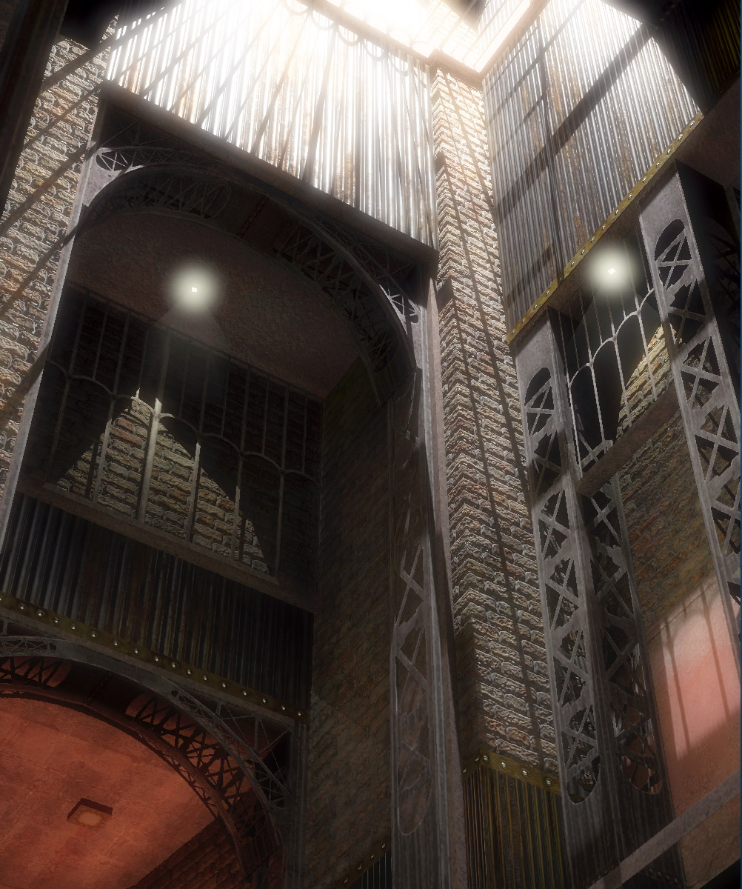

# The Rendering Equation

카메라, 빛, 두개의 surface가 있는 간단한 `scene`을 생각해보자. 왼쪽의 전구가 `photons`를 내뿜는다. 이 photons는 한 점에서 생성되어 직선을 따라 돌아다닌다. 이러한 stream of photons를 `lighy ray`라고 부른다. photons는 결국에는 `surface`와 어느 한점에서 부딪히고, 그 점을 Y라고 하겠다. 따라서, surface들 사이의 photons의 경로는 하나의 `line segment`로 나타내어진다. rendering 목적으로, surface를 두개의 `homogeneous material`의 경계라고 생각한다. 그림에 묘사되어있듯, 공기 사이의 경계 또는 콘크리트 천장같이 significant density를 가진 object일 수 있다.

Surface에서는 photons의 이부는 흡수되어 object의 온도를 살짝 올린다. 이는 rendering에는 영향이 없다. 다른 photons는 다양한 각도로 분산(scatter)된다. scattering의 방향은 surface의 material properties에 따라 결정된다. 그림에서는 이를 $\overrightarrow{w}$로 표현하며 방향을 나타내기위해 `i`와 `o` 첨자를 사용한다.

photon의 가능한 scattering path 중에 camera로 들어가는 것은 `sensor pixels`에 의해 측정된다. diagram을 보면, emitting된 photon이 camera로 들어가는 한가지 path를 검은색 점선으로 표현하고 있다. 대부분의 photons는 camera로 흡수되지 않고 무한히 분산되고 흡수되다가 사라진다.

카메라가 매우 작은 aperture를 가지고 pixels의 가로 세로 길이가 작다면, pixel의 incoming light energy는 scene의 매우 작은 region만을 담고 있다. measure area가 계속 작아져 거의 0에 달한다면, pixel과 aperture는 하나의 점에 불과하다. 이 경우, 각 pixel에 측정된 energy는 하나의 light ray에서 전달되며, 이 ray를 `primary ray` 라고 한다.

`**Rendering Equation**`은 physically-based rendering에 대한 equation을 정의한다. 임의의 scene에 대해서 rendering equation을 analytically 하게 푸는 것은 불가능에 가깝다. 그래서, 효율적으로 이에 근사하는 방법에 대한 알고리즘이 선구되었다. scene과 application에 따라 다른 methods들이 선호되며, 이로인해서 수많은 발전 기회가 있고, single best rendering algorithm은 존재하지 않는다.

오늘날 가장 빠른 realistic rendering 알고리즘은 milliseconds안에 실행되어 photorealistic한 scene을 만들어낸다. 예를들어, 아래 이미지는 NVIDIA의 OptiX API의 `ray casting`과 다양한 `photon mapping algorithm`을 통해 30ms 만에 생성되었다.

`ray casting`과 `photon mapping` 모두 core rendering algorithms이다. 해당 research가 발행되고 현재에 이르러 ray casting은 새로운 알고리즘과 하드웨어로 50배 가까이 빨라졌다. 오늘날에는 일반 게이밍 컴퓨터에서 3ms 이내에 실행 가능하다. 이 강의를 통해 얻게될 ray-based rendering 기술은 high end CPU 또는 midrange GPU에서 offline & real-time rendering이 모두 가능하다. 이는 rasterization-based methods의 기저를 이루며, 추후 모든 rendering을 dominate할 것이다.