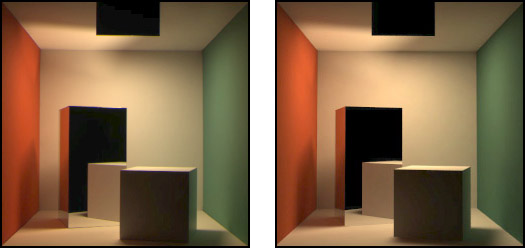

# Images and Light

Cornell Box, Left : Photograph, Right : Computer Graphics

### 1. Images and Light

Energy는 photons stream의 빛 형태로 surface에 부딪힐 때까지 ray를 따라 전파된다. 
surface에 부딪히면 absorbed 되거나 scaterred 된다. scattered된 photons는 또 새로운 ray를 따라 다른 surface에 부딪힐 때까지 전진하고, 이런 과정을 반복한다.
scattered light가 camera의 객체나 사람 눈동자같은 aperture에 잡히면 image를 형성한다.

Photorealistic rendering은 `Rediometry` 와 `Computer Science` 를 합친 것이다. `Rediometry`는 wavelength, energy, power, light와 같은 physical properties에 대한 measurement이다. 

`Photometry` 는 human observer의 energy에 대한 perception을 설명하는 `Rediometry`에 alternative 한 system이다.